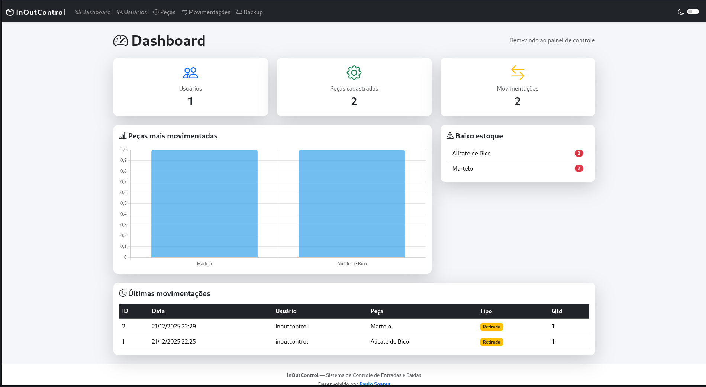
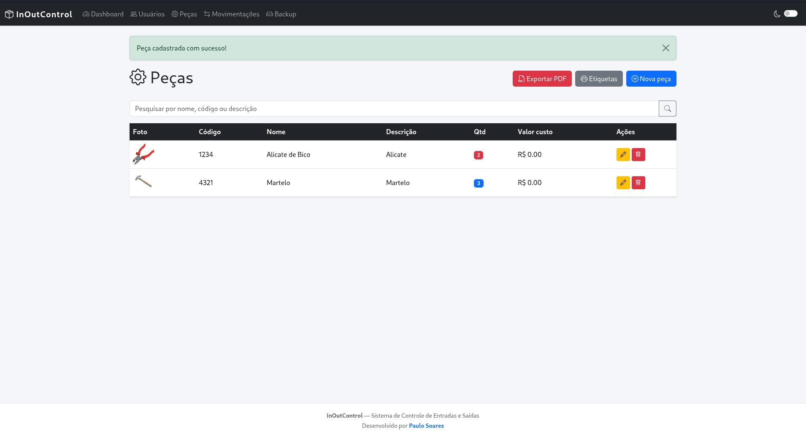
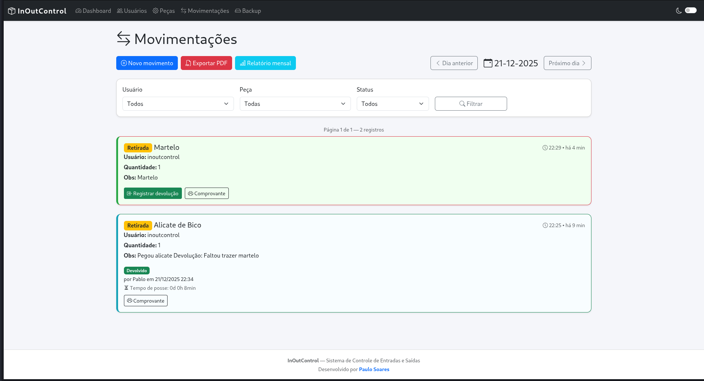

# 📦 InOutControl — Sistema de Controle de Entradas e Saídas de Peças

O **InOutControl** é uma aplicação web desenvolvida em **Flask** para gerenciar o fluxo de **entradas e saídas de peças em estoque**.  
Ele oferece recursos de cadastro de peças e usuários, controle de movimentações, geração de relatórios em PDF, além de suporte a QR Code e código de barras para identificação rápida.

---

## ✨ Funcionalidades
- Dashboard com visão geral das movimentações
- Cadastro e gerenciamento de usuários
- Controle de peças (inclusão, edição e exclusão)
- Registro de entradas e saídas de estoque
- Upload de imagens de peças
- Relatórios em PDF com **WeasyPrint**
- Identificação por QR Code e código de barras
- Backup de dados
- Paginação para grandes volumes de registros

---

## 🖼️ Screenshots

### Dashboard


### Cadastro de Peças


### Movimentação


---

## ⚙️ Tecnologias utilizadas
- **Flask** (framework web)
- **Flask-SQLAlchemy** (ORM)
- **SQLite** (banco de dados)
- **WeasyPrint** (PDF)
- **qrcode / python-barcode / Pillow** (QR Code e código de barras)
- **Flask-Paginate** (paginação)
- **python-dotenv** (variáveis de ambiente)

---

# 🚀 Guia de Instalação — InOutControl (Windows)

## 1. Pré-requisitos

- [ ] Instalar **Python 3.10+** ([Download](https://www.python.org/downloads/))
- [ ] Verificar instalação:

```
py --version
```

- [ ] Instalar Git (opcional, para clonar repositório)


### 2. Criar ambiente virtual

No terminal (PowerShell ou CMD), dentro da pasta do projeto:

```
py -m venv venv
Ativar o ambiente:
```

```
venv\Scripts\activate
```

### 3. Instalar dependências

```
pip install -r requirements.txt
```

### 4. Banco de Dados

> O banco SQLite será criado automaticamente como inoutcontrol.db na raiz do projeto.

```
py run.py
```

O SQLAlchemy criará as tabelas.

### 5. Executar o servidor

> No terminal, com o ambiente virtual ativo:

```
py run.py
```

### 6. Extras (Windows)

- Para geração de PDF com WeasyPrint, instale dependências gráficas:

- GTK, Cairo e Pango (via instalador do Windows).

- Para desenvolvimento:

```
set FLASK_ENV=development
flask run
```

### Acesse no navegador:

```
http://127.0.0.1:5000
```


---

## 🧾 Licença

Este projeto é licenciado sob a licença `MIT`. Veja o arquivo [**LICENSE**](https://github.com/soarespaullo/InOutControl/blob/main/LICENSE) para mais detalhes.

---

## 👨‍💻 Autor

Feito com ❤️ por [**Paulo Soares**](https://soarespaullo.github.io/) – `Pull Requests` são bem-vindos!

- 📧 [**soarespaullo@proton.me**](mailto:soarespaullo@proton.me)

- 💬 [**@soarespaullo**](https://t.me/soarespaullo) no Telegram

- 💻 [**GitHub**](https://github.com/soarespaullo)

- 🐞 [**NotABug**](https://notabug.org/soarespaullo)

---
